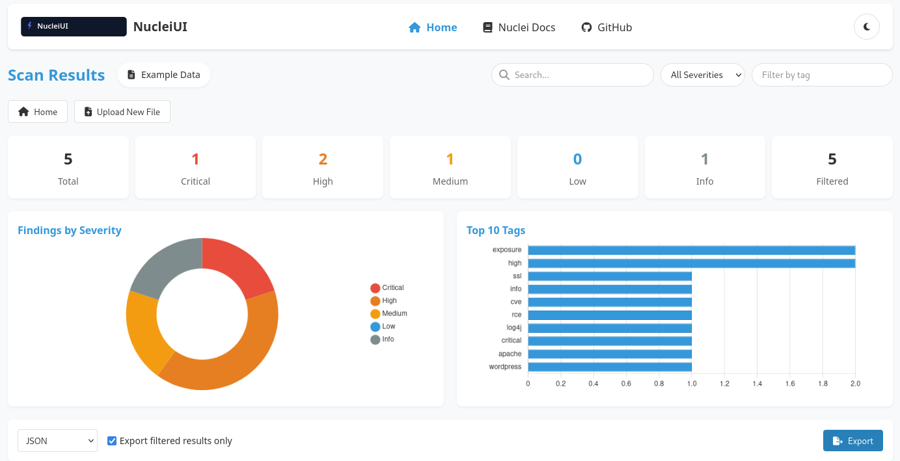
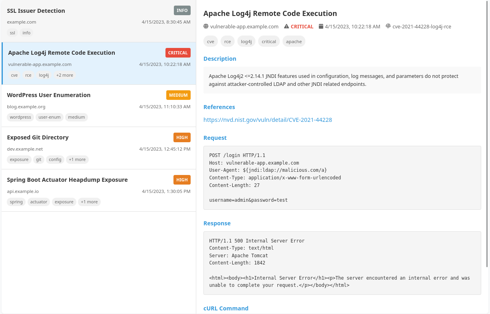

# 🚀 NucleiUI - Visualize Your Nuclei Scan Results!

## 🔥 What is NucleiUI?

**NucleiUI** is a powerful, browser-based visualization tool for your [Nuclei](https://github.com/projectdiscovery/nuclei) scan results!  
No more staring at raw JSON files or scrolling through endless terminal output. With NucleiUI, you can upload your scan results and instantly get **beautiful, interactive visualizations** that help you understand your security findings better.

> 🎯 _Shoot First. View Scans Later._

---




## ✨ Features

### 📊 Visual Charts & Statistics
- Severity breakdown charts — instantly see **critical**, **high**, **medium**, **low**, and **info** findings
- Top tags visualization — identify recurring vulnerability patterns
- Interactive statistics — click and filter to drill down into specific data

### 🔍 Advanced Search & Filtering
- Deep search across **ALL** data (including request/response content!)
- Filter by severity to focus on what matters most
- Tag-based filtering to group related vulnerabilities
- Text search to find specific hosts, templates, or vulnerability names

### 📤 Export Options
- **JSON** export — for further processing or automation
- **CSV** export — ideal for spreadsheet analysis
- **HTML report** — beautiful, shareable, and perfect for teams or clients

### 🌙 Dark Mode
Because your eyes deserve better at 3am during a pentest 🕶️

### 🔒 Privacy Focused
- 100% **client-side** — your data never leaves your browser
- No server required — everything happens locally

---

## 🚀 Getting Started

### Option 1: Use the Live Version
👉 Visit the [Live Demo](https://github.com/queencitycyber/nucleiUI) to use NucleiUI directly in your browser!

### Option 2: Run Locally

```bash
# Clone the repository
git clone https://github.com/queencitycyber/nucleiUI.git

# Navigate to the project directory
cd nucleiUI

# Open index.html in your browser
# OR use a local server:

# Python 3
python -m http.server

# Node.js with http-server
npx http-server
```

---

## 📋 How to Use
1. Upload your Nuclei JSON results by drag-and-drop or using the file browser

2. Explore the visualizations in the dashboard

3. Use filtering and search to focus on specific findings

4. Click on any finding to view detailed information, including request/response data

5. Export your results as JSON, CSV, or HTML

> 🧪 Don’t have scan results handy? Click the "Load Example Data" button to try it with sample findings.

---

#### 🔐 Remember: Good security starts with good visibility. NucleiUI helps you see clearly.